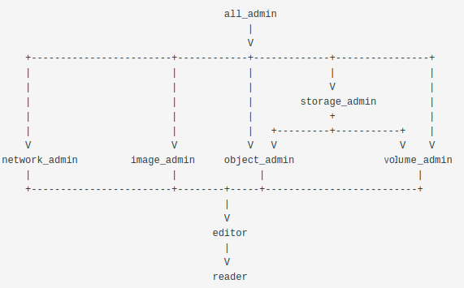

# Implied Role Assignment for Kubernetes

## 1. Vision and Goals of the Project

The RBAC (role-based access control) model needs to support improved delegation in order to scale. The goal is to transfer from coarse grained access control to finer-grained model, to be able to minimize the burden on the administrators, and grant a user all the privileges they need for a specific namespace with a single role assignment. High-level goals of RBAC include:

- A user should be able to delegate a subset of their capabilities
- Casual users should be able to provide access to a subset of their resources without providing full access to all of them
- Allow relationships between roles to be defined where one (larger more powerful role) can imply that the user also obtains a set of smaller (less powerful) roles
- Both explicitly assigned and implied roles will be included when listing roles assigned to a given user
- The model developed should has a generalizable pattern, which is reusable, and scales as our organization scales without having to redefine the rules for every project within our organization

---

## 2. Users/Personas of the Project

The aim of the project is to design and implement a system for implied roles within Kubernetes. Consequently, the following are the personas of the project.

The feature in its completed state will be provided as a Kubernetes operator that will be published on [OperatorHub.io](https://operatorhub.io/).

As a result, the end users are expected to be users 
- that administer or have permissions to administer Kuberentes.
- use the operator as published on OperatorHub for the Implied Role feature.

---

## 3. Scope and Features of the Project:

Users are assigned to roles within a namespace to perform operations. In order to better model the typical hierarchical authority model of a large organization, we will allow relationships between roles to be defined where one (larger more powerful role) can imply that the user also obtains a set of smaller (less powerful) roles.

The roles can be viewed as a hierarchy:
- Larger roles inherit the permissions assigned to smaller roles

For example, if a rule states that *admin* implies a *member*, any user assigned the *admin* role will automatically receive the *member* role as well.

The implementation avoids a strict hierarchy in favor of generating a directed-acyclic-graph (DAG): the same role may be implied by multiple prior roles. At enforcement time the required abstraction is a set of role assignments, not a tree or a graph.

The role relationships are illustrated in this ASCII DAG diagram. The prior roles are above implied roles, with the arrows showing the direction of implication. The table below that also explicitly shows these relationships:



For this project, we want to have the feature:
- Assign user new roles by creating implication rules so that the hierarchy of roles shown in the above pircture is created by creating/applying new implication rules, instead of directly assigning new roles to the user.

---

## 4. Architecture

### Initial Cluster Setup
- Create implication rules custom resource definition, which is used to create implication rules custom resources.
- Create implication rules custom resources that defines implication rules. For example: an implication rule custom resource can define that developer role implies writer role.

### Controller Design
- Whenever a role binding or an implication rule custom resource is created, the controller will first get the current users for which role binding is created.
- The controller will then check current roles of the user to find matches between assigned role and implication rule.
- For any matches found, using reconcile function in the controller to add role bindings for the user so that user will have implied roles.
- After reconciliation, user's current roles will contain all the implied roles along with already assigned roles.
- The reconciliation will continue happening whenever there is any change detected by the controller.

---

## 5. Key Design Decisions

The operator is built as a combination of a **CRD** (Custom Resource Definition) and a **Controller** (written in Go). The design specifications of both components are outlined below.

## CRD

A **Custom Resource** (CR) contains a **Spec** and a **Status**. The **Spec** is effectively the schema for the desired state of implied roles in a cluster. The **Status** is a schema for the current state of implied roles in a cluster.

Each _implication_ (parent role implies child role) is a CR in the cluster.

### Spec

The spec is defined below. An implied roles CR contains a one to one mapping of `ParentRole` to `ChildRole`.

```golang
type Rule struct {
    ParentRole      string      `json:"parent_role,omitempty"`
    ChildRole       string      `json:"child_role,omitempty"`
}

type ImpliedRolesSpec struct {	
    InferenceRule   Rule        `json:"inference_rule,omitempty"`
}
```

### Status

The status is defined below. The `Inferences` contain a one-to-many mapping of `ParentRole` to multiple `ChildRoles`. The `ChildRoles` are all roles that a `ParentRole` would imply i.e. all roles that are descendants of `ParentRole` if one were to imagine all implication rules as a tree. 

```golang
type RuleInferences struct {
    ParentRole  string          `json:"parent_role,omitempty"`
    ChildRoles  []string        `json:"child_roles,omitempty"`
}

type ImpliedRolesStatus struct {
    Inferences  RuleInferences  `json:"inferences,omitempty"`
}
```

### CR Sample

This is an example of a implied roles CR defined in a `yaml`.

```yaml
kind: ImpliedRoles
metadata:
    name: impliedroles-sample
spec:
    inference_rule:
        parent_role: admin
        child_role: writer
```

## Controller

### Reconciler function

**Trigger:**

- Role-binding is created. &#8594; Role assignment (Through role binding yaml) \
&nbsp;&nbsp;&nbsp;&nbsp;&nbsp;&nbsp;Kubectl apply (Only to current User)
- Role-binding is updated. &#8594; Role assignment (Through role binding yaml)\ 
&nbsp;&nbsp;&nbsp;&nbsp;&nbsp;&nbsp;Kubectl apply (Only to current User)
- Role un assignment using yaml, deleted role binding - Need to look how\
&nbsp;&nbsp;&nbsp;&nbsp;&nbsp;&nbsp;kubectl delete (Only to current User)
- Create the CRD that implies the implied role.\
&nbsp;&nbsp;&nbsp;&nbsp;&nbsp;&nbsp;Create implied roles and create role bindings (Across all users)
- Update the CRD that implies the implied role.\
&nbsp;&nbsp;&nbsp;&nbsp;&nbsp;&nbsp;Update implied roles and create role bindings (Across all users)
- Delete the CRD that implies the implied role.\
&nbsp;&nbsp;&nbsp;&nbsp;&nbsp;&nbsp;Delete all implied roles and implied role bindings (Across all users)
- If you delete the role, it needs to be deleted from role binding and CRD \
&nbsp;&nbsp;&nbsp;&nbsp;&nbsp;&nbsp;NOT IN SCOPE (Look into this if kubernetes automatically handles this)

---

## 6. Acceptance Criteria

- After creating/updating implied rules, user will be automatically assigned to implied roles according to the implied rules assigned. For example: if an user has developer role, and we create an implied rule that specifies that developer implies writer, and after applying this implied rule, now the user will also have writer role.
- When an implication rule is deleted, the corresponding implied role binding will be automatically deleted, without affecting user's original role binding. For example: if an user has developer role and implied writer role from the implication rule that states that developer implies writer. When the implication rule is deleted, the user will not have writer role anymore, but still keeps the developer role. 

---

## 7. Accomplishments

- Able to create role bindings that assign roles to users.
- Able to create implication rules that define implied roles for existing roles.
- Able to automatically update existing role bindings after creating/updating implication rules.
- Able to automatically delete all implied role bindings after deleting the original role bindings of that user.
- Able to automatically add back all implied role bindings after adding the origin role binding back.
- Able to delete a specific implied role binding by deleting the corresponding implied rule, without affecting the original role binding for the user. 

---

## 8. Major Obstacles

- We spent a lot of time trying to figure out our expectation for this project and the design of the operator. 
- Some of us were unfamiliar to the technology, such as Kubernetes and Go Language. In the first half of the semester, we spent a lot of time going through tutorials about Operator and Go Language, and when we started our coding phase, we realized we didn't have enough to optimize our code and write tests.
- It was hard to coordinate since all the work was done online. We ended up deviding different parts of code to different team members, and we spent some extra time to merge and reconcile all the code.

---

## 9. Final Demo
Here is the link of our final demo: https://drive.google.com/file/d/1cgoTSG3iLmP8NV8D1OvEailUgx3i_oTk/view?usp=sharing
