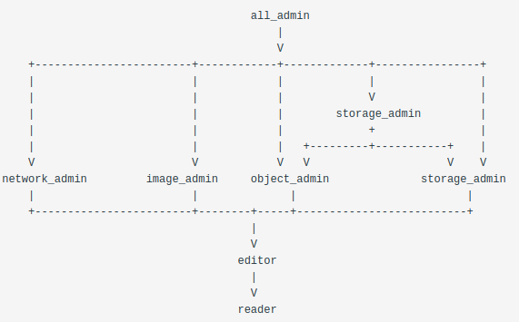

# Implied Role Assignment for Kubernetes

## 1. Vision and Goals of the Project

The RBAC (role-based access control) model needs to support improved delegation in order to scale. The goal is to transfer from coarse grained access control to finer-grained model, to be able to minimize the burden on the administrators, and grant a user all the privileges they need for a specific namespace with a single role assignment. High-level goals of RBAC include:

- A user should be able to delegate a subset of their capabilities
- Casual users should be able to provide access to a subset of their resources without providing full access to all of them
- Allow relationships between roles to be defined where one (larger more powerful role) can imply that the user also obtains a set of smaller (less powerful) roles
- Both explicitly assigned and implied roles will be included when listing roles assigned to a given user
- The model developed should has a generalizable pattern, which is reusable, and scales as our organization scales without having to redefine the rules for every project within our organization

---

## 2. Users/Personas of the Project

The aim of the project is to design and implement a system for implied roles within Kubernetes. Consequently, the following are the personas of the project.

### Design and Implementation
The following are the personas responsible for design and implementation of the **Implied Roles** feature within Kubernetes.
#### Mentor
- Adam Young
#### Team
- Anand Hegde
- Neeharika Kompala
- Rahul Pandey
- Rongyi Chen
- Yuting Zhang

### End Users

The feature in its completed state will be provided as a Kubernetes operator that will be published on [OperatorHub.io](https://operatorhub.io/).

As a result, the end users are expected to be users 
- that administer or have permissions to administer Kuberentes.
- use the operator as published on OperatorHub for the Implied Role feature.

---

## 3. Scope and Features of the Project:

Users are assigned to roles within a namespace to perform operations. In order to better model the typical hierarchical authority model of a large organization, we will allow relationships between roles to be defined where one (larger more powerful role) can imply that the user also obtains a set of smaller (less powerful) roles.

The roles can be viewed as a hierarchy:
- Larger roles inherit the permissions assigned to smaller roles

For example, if a rule states that *admin* implies a *member*, any user assigned the *admin* role will automatically receive the *member* role as well.

The implementation avoids a strict hierarchy in favor of generating a directed-acyclic-graph (DAG): the same role may be implied by multiple prior roles. At enforcement time the required abstraction is a set of role assignments, not a tree or a graph.

An example set of implied roles: 
- The *reader* role is for people that need to be able to inspect the values of resources in a namespace, but not make any changes to those resources. 
- The *editor* role is for people that need to make standard changes, such as creating new virtual machines and allocating a floating IP address. All users with *editor* roles should have access to the resources specified by the *reader* role.

Each of the services have their own admin roles defined. In addition, the two storage focused services have a joint role called *storage_admin* that implies both *object_admin* and *storage_admin*.

If a user is assigned *all_admin* in a namespace and requests access for that namespace, the response will have all of the implied roles enumerated in it: *storage_admin*, *network_admin*, *image_admin*, *object_admin*, *editor*, and *reader*.

- Any form of admin is implicitly an editor. 
- A reader can view standard data from any of the systems, but cannot affect any change.
- The editor role is superior to the reader; there would be no reason to assign someone the editor role without assigning the reader role as well. 
- We often want to assign the reader role without the editor role for audit and monitoring.

The role relationships are illustrated in this ASCII DAG diagram. The prior roles are above implied roles, with the arrows showing the direction of implication. The table below that also explicitly shows these relationships:

---

## 4. Solution Concept

A high-level orientation of the solution that is envisaged in order to meet the objectives of the architecture engagement -- 

Prerequisites - \
Workspace \
SQL backend (implicit roles assignment)

Steps:
1. Meet prerequisites
2. Create/Configure Groups
3. Configure cluster to use these groups
4. Define and assign permission to these groups using ClusterRole / RoleBinding
5. Troubleshooting and Debugging
6. Limitations

Design Implications :

\<Wireframes\>

key objectives \
requirements \
constraints for the engagement \
highlight work areas to be investigated in more detail

Discussion:

Design decisions made during the global architecture design.

Limitations:

Discussions and decisions taken, why?

---

## 5. Acceptance Criteria

- Users are assigned to roles within a namespace to perform operations. The role relationships should be implemented. 
- Both explicitly assigned and implied roles will be included when roles assigned to a given user. If a user was explicitly assigned a role on a namespace, the validation of a token for that user and scoped to the namespace would have the roles. 
- SQL backend should be implemented. Other backends will follow if requested.

---

## 6.  Release Planning:

### Project Preparation #1 (due by week 1)
- Understand what containers are
- Understand what Kubernetes is
- Make sure how to run Minikube
- Understand how the role access controls works under minikube in general

### Project Preparation #2 (due by week 2)
- Have a Minikube system up and running, with a CRD – customer resource descriptor
- A role and two different users – one who has that role can get access to it, and one who - doesn’t have that role doesn’t have access to it
- Get a minimal operator working on Minikube
